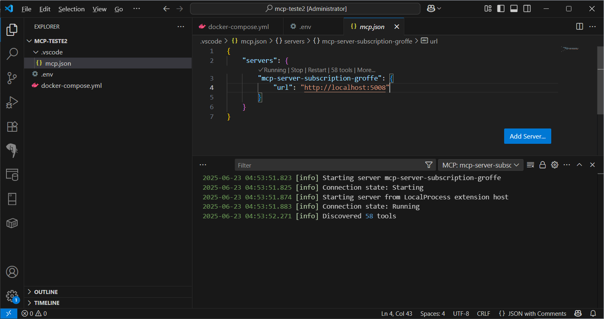
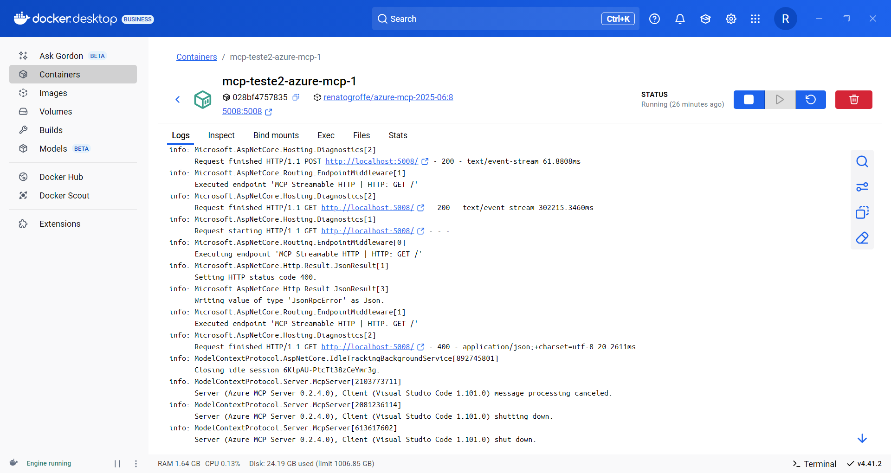
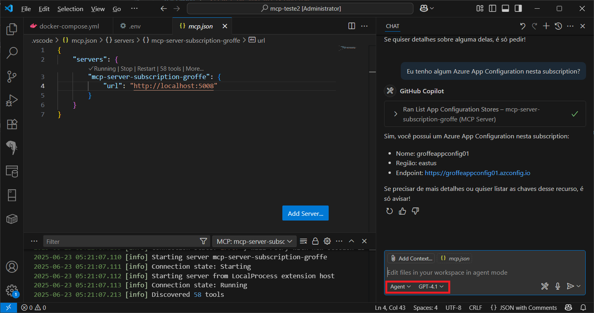
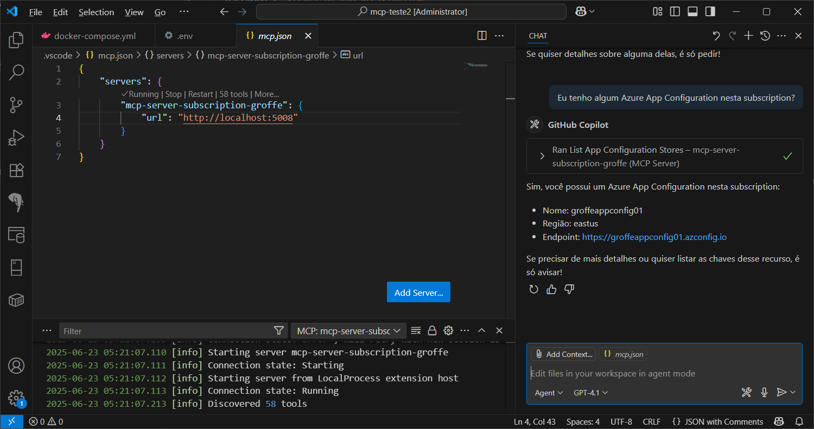

# azure-mcp-2025
Testes com Azure MCP Server durante o mês de Junho-2026. Envolve o uso de containers (build + publish no Docker Hub, Docker Compose para testes com VS Code).

Imagem pública mais recente para testes:

```
renatogroffe/azure-mcp-2025-06:8
```

Por qual razão criei uma imagem, ao invés de usar a versão que está no catálogo de MCP Server da própria Docker?
1) A própria Microsoft recomenda isto na [documentação](https://github.com/Azure/azure-mcp?tab=readme-ov-file#-docker-install-steps-optional) do projeto.
2) O projeto está em constante evolução e as [imagens](https://hub.docker.com/r/mcp/azure) do próprio catálogo MCP no Docker Hub podem náo estar atualizadas com melhorias recentes. Ao tentar usar a documentação da Microsoft não obtive nenhuma referência quanto a executar o container com os parâmetros **--transport sse** como indicado mais adiante; tentei reproduzir as mesmas configurações com a imagem no Docker Hub e não obtive sucesso. Acabei por ajudar no report deste problema em uma [**issue**](https://github.com/Azure/azure-mcp/issues/434) que estava aberta no GitHub.

Será necessária a criação de um Service Principal, em que para efeito de testes associei permissões como **reader**:

```bash
az ad sp create-for-rbac --name testes-mcp-azure --role Reader --scopes /subscriptions/SUBSCRIPTION_ID
```

Que produzirá como retorno um JSON com as configurações da App Registration que representa o Service Principal:

```json
{
  "appId": "ID DA APP REGISTRATION",
  "displayName": "testes-mcp-azure",
  "password": "SECRET DA APP REGISTRATION",
  "tenant": "ID DO TENANT EM QUE SE ENCONTRA A SUBSCRIPTION"
}
```

Essas configurações deverão então ser informadas nas variáveis **AZURE_TENANT_ID**, **AZURE_CLIENT_ID** e **AZURE_CLIENT_SECRET**, que se encontram no **arquivo .env** (pasta **scripts**).

Criando o server MCP via **docker run**:

```bash
docker run -d --env-file .env -p 5008:5008 renatogroffe/azure-mcp-2025-06:8 --transport sse
```

Opcionalmente, é possível também utilizar o arquivo que está na pasta **scripts** e inicializar o ambiente via comando:

```bash
docker-compose up -d
```

MCP Server em execução e integração para o mesmo já configurada no Visual Studio Code:



Visualizando os logs gerados via Docker Desktop:



Exemplos de uso com o chat do GitHub Copilot (com o uso de **Agent** selecionado):




